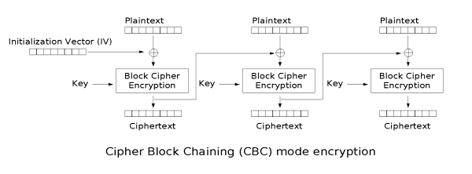

---
tags:
  - Crypto
  - cheatsheet
---

# برگه تقلب

راهنمای فشرده‌ای شامل تکه‌کدها و اطلاعات کلیدی برای مرور سریع مفاهیم و الگوریتم‌های پرکاربرد رمزنگاری. مناسب برای افراد با دانش قبلی در این حوزه

---


<div dir="ltr" markdown="1">


## Hash
- [Comparison of cryptographic hash functions](https://en.wikipedia.org/wiki/Comparison_of_cryptographic_hash_functions)
- [List of hash functions](https://en.wikipedia.org/wiki/List_of_hash_functions)
- [Hash function security summary](https://en.wikipedia.org/wiki/Hash_function_security_summary)
- Example hashes ([1](https://hashcat.net/wiki/doku.php?id=example_hashes), [2](https://openwall.info/wiki/john/sample-hashes))

=== "hashlib"
    ```python
    import hashlib
    hashlib.sha1(b'salam').hexdigest()

    print(hashlib.algorithms_guaranteed)
    # {'blake2b', 'blake2s', 'md5', 'sha1', 'sha224', 'sha256', 'sha384', 'sha3_224', 'sha3_256', 'sha3_384', 'sha3_512', 'sha512', 'shake_128', 'shake_256'}

    print(hashlib.algorithms_available - hashlib.algorithms_guaranteed)
    # {'md5-sha1', 'ripemd160', 'sha512_224', 'sha512_256', 'sm3'}
    ```
=== "Crypto"
    ```python
    from Crypto.Hash import SHA
    SHA.new(b'salam').hexdigest()
    ```

### Identify hash
- https://www.kali.org/tools/hash-identifier
- https://www.tunnelsup.com/hash-analyzer
- https://www.onlinehashcrack.com/hash-identification.php


### [Length extension attack](https://en.wikipedia.org/wiki/Length_extension_attack)

1. If `Hash` is vulnerable (e.g., MD5, SHA-1):
    - Knowing `Hash(message1)` and the **length** of `message1`, you can compute `Hash(message1 ‖ message2)` **without knowing message1**.
2. Problematic when the hash is used as a Message Authentication Code (MAC).
3. Allows attackers to append data (`message2`) and forge valid hashes.

#### Tools
  - [Hash Extender](https://github.com/iagox86/hash_extender)  by Ron Bowes
    ```bash
    ./hash_extender -f sha1 -l 1200 -d "GET FILE: " -a "flag.txt" -s b41bd8ce52b42738175f7d4f32c54077789bf4e7
    ```
  - [hlextend](https://github.com/stephenbradshaw/hlextend): Pure Python hash length extension module
- sample writeup: [TagSeries3](https://ctftime.org/writeup/38949) @ WolvCTF 2024

### Hash collisions
- [Hash collisions and exploitations](https://github.com/corkami/collisions)
- [PHP hash collisions](https://github.com/spaze/hashes)

#### [example](https://github.com/corkami/collisions/blob/master/examples/free/README.md)
<figure style="text-align: center;">
  <div style="display: flex; justify-content: center; gap: 2px;">
    
    
  </div>
  <figcaption style="font-size: 0.9em; text-align: center; margin-top: 10px;">
    These 2 images have the same md5 hash: 253dd04e87492e4fc3471de5e776bc3d (<a href="https://natmchugh.blogspot.com/2015/02/create-your-own-md5-collisions.html">ref</a>)
  </figcaption>
</figure>
=== "md5"
    ```python
    from hashlib import md5

    a = bytes.fromhex('4dc968ff0ee35c209572d4777b721587d36fa7b21bdc56b74a3dc0783e7b9518afbfa200a8284bf36e8e4b55b35f427593d849676da0d1555d8360fb5f07fea2')
    b = bytes.fromhex('4dc968ff0ee35c209572d4777b721587d36fa7b21bdc56b74a3dc0783e7b9518afbfa202a8284bf36e8e4b55b35f427593d849676da0d1d55d8360fb5f07fea2')
    assert a!=b and md5(a).hexdigest() == md5(b).hexdigest()

    a = bytes.fromhex('0e306561559aa787d00bc6f70bbdfe3404cf03659e744f8534c00ffb659c4c8740cc942feb2da115a3f415dcbb8607497386656d7d1f34a42059d78f5a8dd1ef')
    b = bytes.fromhex('0e306561559aa787d00bc6f70bbdfe3404cf03659e704f8534c00ffb659c4c8740cc942feb2da115a3f4155cbb8607497386656d7d1f34a42059d78f5a8dd1ef')
    assert a!=b and md5(a).hexdigest() == md5(b).hexdigest()

    a = b"TEXTCOLLBYfGiJUETHQ4hAcKSMd5zYpgqf1YRDhkmxHkhPWptrkoyz28wnI9V0aHeAuaKnak"
    b = b"TEXTCOLLBYfGiJUETHQ4hEcKSMd5zYpgqf1YRDhkmxHkhPWptrkoyz28wnI9V0aHeAuaKnak"
    assert a!=b and md5(a).hexdigest() == md5(b).hexdigest()

    a = bytes.fromhex("d131dd02c5e6eec4693d9a0698aff95c2fcab58712467eab4004583eb8fb7f8955ad340609f4b30283e488832571415a085125e8f7cdc99fd91dbdf280373c5bd8823e3156348f5bae6dacd436c919c6dd53e2b487da03fd02396306d248cda0e99f33420f577ee8ce54b67080a80d1ec69821bcb6a8839396f9652b6ff72a70")
    b = bytes.fromhex("d131dd02c5e6eec4693d9a0698aff95c2fcab50712467eab4004583eb8fb7f8955ad340609f4b30283e4888325f1415a085125e8f7cdc99fd91dbd7280373c5bd8823e3156348f5bae6dacd436c919c6dd53e23487da03fd02396306d248cda0e99f33420f577ee8ce54b67080280d1ec69821bcb6a8839396f965ab6ff72a70")
    assert a!=b and md5(a).hexdigest() == md5(b).hexdigest()
    ```
=== "SHA0"
    ```python
    # Collisions on SHA-0 in One Hour
    # https://www.iacr.org/cryptodb/data/paper.php?pubkey=15614
    a = bytes.fromhex("4643450b41d35081fe16dd9b3ba36244e642405516ca44a020f6244410f7465a5a71188751479678726a0718703f5bfbb7d61841a52800036b08d26e2e4df0d89a74cf7004f9957dee26223d9a06e4b5b8408af6b86086128b7e0feae17e363ca2f1b8e5ca07993602f2a7cbf724e83837ffc03a53aa8c4390811819312d423e")
    b = bytes.fromhex("4643454941d350c1fe16dddb3ba362046642401796ca44a0a0f6240410f7465a5a7118c5d147963a726a0718703f5bb9b7d61801a52800416b08d26cae4df0d89a74cf3204f9953dee26227d9a06e4f538408ab4386086120b7e0faae17e363ca2f1b8a74a07997402f2a7cbf724e87a37ffc07a53aa8c019081181bb12d423e")
    assert a!=b and sha0(a) == sha0(b)
    ```
=== "SHA1"
    ```python
    from hashlib import sha1
    # 8ac60ba76f1999a1ab70223f225aefdc78d4ddc0
    a = bytes.fromhex('99040d047fe81780012000ff4b65792069732070617274206f66206120636f6c6c6973696f6e212049742773206120747261702179c61af0afcc054515d9274e7307624b1dc7fb23988bb8de8b575dba7b9eab31c1674b6d974378a827732ff5851c76a2e60772b5a47ce1eac40bb993c12d8c70e24a4f8d5fcdedc1b32c9cf19e31af2429759d42e4dfdb31719f587623ee552939b6dcdc459fca53553b70f87ede30a247ea3af6c759a2f20b320d760db64ff479084fd3ccb3cdd48362d96a9c430617caff6c36c637e53fde28417f626fec54ed7943a46e5f5730f2bb38fb1df6e0090010d00e24ad78bf92641993608e8d158a789f34c46fe1e6027f35a4cbfb827076c50eca0e8b7cca69bb2c2b790259f9bf9570dd8d4437a3115faff7c3cac09ad25266055c27104755178eaeff825a2caa2acfb5de64ce7641dc59a541a9fc9c756756e2e23dc713c8c24c9790aa6b0e38a7f55f14452a1ca2850ddd9562fd9a18ad42496aa97008f74672f68ef461eb88b09933d626b4f918749cc027fddd6c425fc4216835d0134d15285bab2cb784a4f7cbb4fb514d4bf0f6237cf00a9e9f132b9a066e6fd17f6c42987478586ff651af96747fb426b9872b9a88e4063f59bb334cc00650f83a80c42751b71974d300fc2819a2e8f1e32c1b51cb18e6bfc4db9baef675d4aaf5b1574a047f8f6dd2ec153a93412293974d928f88ced9363cfef97ce2e742bf34c96b8ef3875676fea5cca8e5f7dea0bab2413d4de00ee71ee01f162bdb6d1eafd925e6aebaae6a354ef17cf205a404fbdb12fc454d41fdd95cf2459664a2ad032d1da60a73264075d7f1e0d6c1403ae7a0d861df3fe5707188dd5e07d1589b9f8b6630553f8fc352b3e0c27da80bddba4c64020d')
    b = bytes.fromhex('99030d047fe81780011800ff50726163746963616c205348412d312063686f73656e2d70726566697820636f6c6c6973696f6e211d276c6ba661e1040e1f7d767f076249ddc7fb332c8bb8c2b7575dbec79eab2be1674b7db34378b4cb732fe1891c76a0260772a5107ce1f6e80bb9977d2d8c68524a4f9d5fcdedcd0b2c9ce19231af26e9759d5250dfdb2d4d9f58729fee553319b6dccc619fca4fb93b70ec72de30a087ea3ae67359a2ee27320d72b1b64fecc9084fc3ccb3cdd83b62d97a904306150aff6c267237e523e228417bde6fec4ecd7943b44a5f572c1ebb38ef11f6e00bc010d01e90ad78a3be641997dc8e8d0d3a789f24c46fe1eaba7f35b4c7fb8272b6c50edaba8b7cd655bb2c2fc50259e39f9570cda94437bffd5fafe3cfcac09812526615e827105b79178eaa43825a341a2acfa5de64ce7af9dc59b54da9fc9eb56756f2563dc70ff4c24c932caa6b1418a7f54f30452a004e850dc99962fd98d8ad4259dea97014db4672f232f461f338b09923d626b4f5a0749cd02bfddd6e825fc431dc35d00f7115285f172cb79e84f7cba4df514d571cf62368fc0a9e9dd32b9a16da6fd16340429870c4586feee1af96647fb426b53f2b9a98e8063f5b7b334cd0b250f826bcc427550b1974c920fc280986e8f1ffc01b51df14e6bfc61b9baee6c1d4aae99d574a00c38f6dca5c153a834122939bf5928f98c2d9363e3ef97cf25342bf28f56b8ef73b5676e485cca8f5d3dea0a65e413d59ec0ee71c201f163b6f6d1eb3f525e6aa06ae6a2dfef17ce205a404f76312fc554141fddb9cf24586d0a2ad1f111da60ecf26406ff7f1e0c6e5403afb4cd861cb33e5707348dd5e1765589b83a7663051838fc34a03e0c26da80bddb6f464021d')
    assert a!=b and sha1(a).hexdigest() == sha1(b).hexdigest()
    ```

    - [Announcing the first SHA1 collision](https://security.googleblog.com/2017/02/announcing-first-sha1-collision.html) ([shattered.io](https://shattered.io))
    - [sha1collider](https://github.com/nneonneo/sha1collider): Build two PDFs that have different content but identical SHA1 sums ([online](http://alf.nu/SHA1))

---

## AES
Advanced Encryption Standard (AES), Advanced Encryption Standard, is a typical block encryption, designed to replace DES, and was designed by Joan Daemen and Vincent Rijmen
```python
from Crypto.Cipher import AES
from Crypto.Util.Padding import pad, unpad

KEY = b'A'*16
cipher = AES.new(KEY, AES.MODE_ECB)

# encryption
msg = b'salam'
enc = cipher.encrypt(pad(msg, AES.block_size))

# decryption
plain = unpad(cipher.decrypt(enc), AES.block_size)
```

### ECB
<div style="display: flex; justify-content: space-between; gap: 10px;">
  <figure style="text-align: center; width: 50%;">
    
    <figcaption>ecb encryption</figcaption>
  </figure>
  <figure style="text-align: center; width: 50%;">
    
    <figcaption>ecb decryption</figcaption>
  </figure>
</div>

### CBC
<div style="display: flex; justify-content: space-between; gap: 10px;">
  <figure style="text-align: center; width: 50%;">
    
    <figcaption>cbc encryption</figcaption>
  </figure>
  <figure style="text-align: center; width: 50%;">
    
    <figcaption>cbc decryption</figcaption>
  </figure>
</div>

### PCBC
<div style="display: flex; justify-content: space-between; gap: 10px;">
  <figure style="text-align: center; width: 50%;">
    
    <figcaption>pcbc encryption</figcaption>
  </figure>
  <figure style="text-align: center; width: 50%;">
    
    <figcaption>pcbc decryption</figcaption>
  </figure>
</div>

### CFB
<div style="display: flex; justify-content: space-between; gap: 10px;">
  <figure style="text-align: center; width: 50%;">
    
    <figcaption>cfb encryption</figcaption>
  </figure>
  <figure style="text-align: center; width: 50%;">
    
    <figcaption>cfb decryption</figcaption>
  </figure>
</div>

### OFB
<div style="display: flex; justify-content: space-between; gap: 10px;">
  <figure style="text-align: center; width: 50%;">
    
    <figcaption>ofb encryption</figcaption>
  </figure>
  <figure style="text-align: center; width: 50%;">
    
    <figcaption>ofb decryption</figcaption>
  </figure>
</div>

### CTR
<div style="display: flex; justify-content: space-between; gap: 10px;">
  <figure style="text-align: center; width: 50%;">
    
    <figcaption>ctr encryption</figcaption>
  </figure>
  <figure style="text-align: center; width: 50%;">
    
    <figcaption>ctr decryption</figcaption>
  </figure>
</div>


